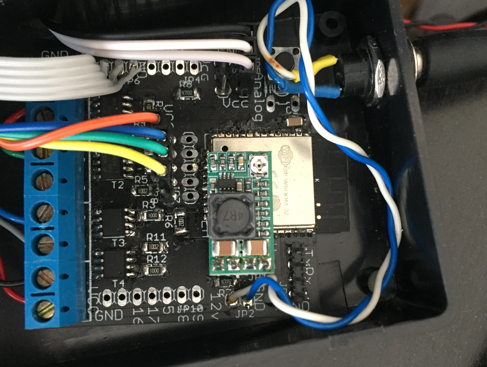

# The homie led multicontroler

This is the [homie](https://homieiot.github.io) compatible led muticontroler project. This project is composed of a software and 2 hardware boards based on esp32 and cheaper esp8266 (to be published soon).

The goal is to provide a multi channel led controller and sensors facility for home automation.

You don't have to be a python or an electronic expert to use this project.


View of in situation ESP32 hardware

# Why this project
The original idea comes from the desire to control lightning at home. I wanted something cheap and simple to use. I initially made a project with lamps connected on mains power and communicating over 433 RF, worked not very well (433 Mhz band is really busy) and dangerous. When I dicovered the ESP8266 boards and micropython I immediatly knew I had to use them. Over the years I embraced standards like MQTT and homie (influenced by OpenHab2). Then I faced I/O shortage on ESP8266 so ESP32 saved me :-) Now the project is mature enough to be published.

# Main features
- homie 3.0 and 4.0 compatible (seamless integration with openHAB for instance)
- json configurable
- controls independant 3 (esp8266) or 4 (esp32) leds channels or RGB group (12v and 24v compatible)
- switches for local led control
- build in compatiblility with DHT, DS1820 and BME/P 280 sensors
- build in compatibility with any ADC sensor
- easy to add your own sensors or actuators
- designed to run on micropython
- very robust, ran for several years now

# Configuration
You will have to provide a configuered json file to the controler, it will be use to determine which platform and which sensor you are using, and then expose the values on the homie side accordingly.

* esp32: boolean (false), set to true if you are running an esp32 platform
* broker: string (empty), the ip of your MQTT broker
* location: string (empty), this will be used in the displayed name of the item like "Multicontroler - <location>"
* dht: boolean (false), set to true if you are using a DHT compatible temperature/humidity sensor 
* ds1820: boolean (false), set to true if you are using a ds1820 temeprature sensor
* bme280: boolean (false), set to true if you are using a bme or bmp 280 sensor, the software can recognize itself bme vs bmp
* analog_period: int (0), interval in seconds of analog sampling and publishing
* analog_bits: int (10) - esp32 only, precision for the analog conversion
* analog_attn: int (0) - esp32 only, attenuation for ADC - 0 is 0 dB, 1 is 2.5 dB, 2 is 6 dB and 3 is 11 dB (see HW desc for more info)
* analog2_* - esp32 only, same as above but for channel 2
* debug: boolean (false), if true the program does not reset the target when an exception occurs

example :
```json
{
  "esp32" : true,
  "broker" : "192.168.2.25",
  "location" : " - buffet",
  "bme280": true,
  "analog_period" : 10,
  "analog_attn" : 3,
}
```

The software is made to run on my hardware, but it can be used on any similar hardware with few modifications.

# Deployment

(more detailed steps to be done)

1 flash micropython binary
2 configure the wifi access
3 upload the software
4 upload umqqt simple and robust from micropython_lib
5 upload the config.json
6 reboot
7 that's it

I will publish a basic tutorial for usage on OpenHAB 2
